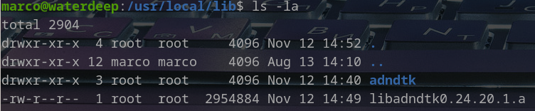
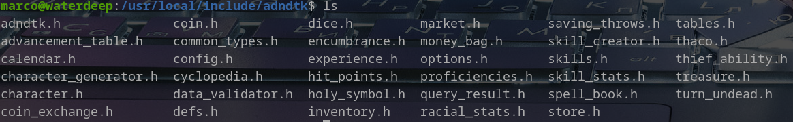
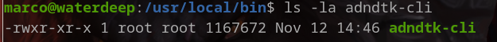
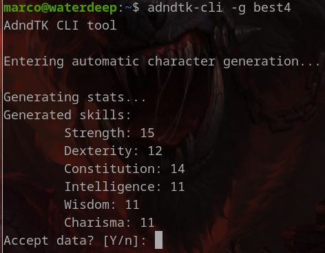
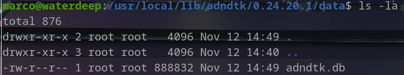

AdndTK - Advanced Dungeons & Dragons (2nd Edition) library and toolkit
=====================================================================

Written by Marco Carosio [https://marcocarosio.it/](https://marcocarosio.it/)

> DISCLAIMER: This software is unofficial content provided under the [Fan Content Policy](https://company.wizards.com/it/fancontentpolicy) of [Wizards of the Coast](https://company.wizards.com/)/[Hasbro](https://products.hasbro.com/it-it) and is not approved or endorsed by the company.

AdndTK is released under [MIT License](LICENSE.md) and in accordance to Fan Content Policy
* it's free of charge;
* it's not an official WOTC product;
* it doesn't make use of copyrighted material;
* it's not sponsored by third parties.

AdndTK is an open C++ role playing game library. It aims to mimic the ruleset of Advanced Dungeons & Dragons 2nd Edition.
AdndTK hides the burden of dealing with the complexity of AD&D ruleset, simplifying the creation of applications like role playing games,
character generators, simulators, and things like that.
It may sound an ambitious project, and it is indeed. I'm working on it in my spare time, that's why the project progress at a slow pace...

You may also be interested in the reason why I decided to implement a legacy ruleset:
* because I enjoyed it so much when I was a teenager;
* because I still consider it as one of the best framework ever conceived;
* because I've always been waiting for [Eye of the Beholder IV](https://en.wikipedia.org/wiki/Eye_of_the_Beholder_(video_game)) and I may eventually need a framework to program it myself.

## Getting Started
The easiest way to have the library compiled, along with the other components built upon it, is typing
<pre>
$ git clone https://gitlab.com/mcarosio/adndtk.git
$ cd adndtk
$ mkdir -p build/
$ cd build/
$ cmake .. [-DRUN_UNIT_TESTS=on|off]
$ cmake --build . -j16
</pre>
After that, if the compile option RUN_UNIT_TESTS is set to ON, the test suite will be executed (it may take time). Tests failure will compromise the correct build of the test executable. If you want to make changes or you would like to perform some debugging on tests, it's better to avoid running the test suite at the end of the build process.
Tests can be skipped specifying the command line option -RUN_UNIT_TESTS=off as in the example.
<pre>
$ mkdir -p build/
$ cd build/
$ cmake .. -DRUN_UNIT_TESTS=off
</pre>
Automatic run of Unit Tests is disabled by default. 

## Dependencies
Check out the [requisites](REQUISITES.md) for project dependencies.

## CLI - Command line tool
AdndTK comes with a specifically designed tool that allows to use the library features interactively, i.e. [adndtk-cli tool](cli/README.md). See the related documentation for further information.

## Installation
To deploy AdndTK and related components to your machine, you first need to configure the build as above. Just add a flag to specify the build type (i.e. Debug or Release):
<pre>
$ mkdir -p build/
$ cd build/
$ cmake .. -DCMAKE_BUILD_TYPE=Debug|Release
</pre>
Then, build the toolkit as usual
<pre>
$ cmake --build . -j24
</pre>
Finally, run the configured installer as:
<pre>
$ sudo make install
</pre>
This will deploy the library and related public headers to the standard location in your machine.
For example, on my linux machine the library location will look smething like this:

The header files will be located similarly:

The CLI tool will be deployed in your binary folder

and added to the command path, so you will be able to launch it from any place

The Sqlite DB will be deployed along with the library itself and the path in the config.h file adjusted accordingly. The db file will be located in a suitable directory

## Future development
AdndTK is under heavy development. Many things can change without notice.
A brief list of future changes, bug fixes and future improvement can be found in the project [Backlog](BACKLOG.md).

Have fun and long life to AD&D!