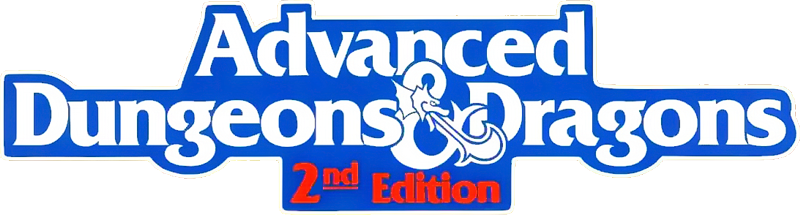

AdndTK - Advanced Dungeons & Dragons (2nd Edition) library and toolkit
=====================================================================

Written by Marco Carosio [https://marcocarosio.it/](https://marcocarosio.it/)

> DISCLAIMER: This software is unofficial content provided under the [Fan Content Policy](https://company.wizards.com/it/fancontentpolicy) of [Wizards of the Coast](https://company.wizards.com/)/[Hasbro](https://products.hasbro.com/it-it) and is not approved or endorsed by the company.

AdndTK is released under [MIT License](LICENSE.md) and in accordance to Fan Content Policy
* it's free of charge;
* it's not an official WOTC product;
* it doesn't make use of copyrighted material;
* it's not sponsored by third parties.

AdndTK is an open C++ role playing game library. It aims to mimic the ruleset of Advanced Dungeons & Dragons 2nd Edition.
AdndTK hides the burden of dealing with the complexity of AD&D ruleset, simplifying the creation of applications like role playing games,
character generators, simulators, and things like that.
It may sound an ambitious project, and it is indeed. I'm working on it in my spare time, that's why the project progress at a slow pace...

You may also be interested in the reason why I decided to implement a legacy ruleset:
* because I enjoyed it so much when I was a teenager;
* because I still consider it as one of the best framework ever conceived;
* because I've always been waiting for [Eye of the Beholder IV](https://en.wikipedia.org/wiki/Eye_of_the_Beholder_(video_game)) and I may eventually need a framework to program it myself.

## Getting Started
The easiest way to have the library compiled, along with the other components built upon it, is typing
<pre>
$ git clone https://gitlab.com/mcarosio/adndtk.git
$ cd adndtk
$ mkdir -p build/
$ cd build/
$ cmake .. [-DRUN_UNIT_TESTS=on|off]
$ cmake --build . -j16
</pre>
After that, the test suit will be executed (it may take time). After that, the test suit will be executed (it may take time). Moreover, tests failure will compromise the correct build of the test executable. If you want to make changes or you would like to perform some debugging on tests, it's better to avoid running the test suite at the end of the build process.
Tests can be skipped specifying the command line option -RUN_UNIT_TESTS=off as in the example
<pre>
$ mkdir -p build/
$ cd build/
$ cmake .. -DRUN_UNIT_TESTS=off
</pre>

## Dependencies
Check out the [requisites](REQUISITES.md) for project dependencies.

## Future development
AdndTK is under heavy development. Many things can change without notice.
A brief list of future changes, bug fixes and future improvement can be found in the project [Backlog](BACKLOG.md).

Have fun and long life to AD&D!