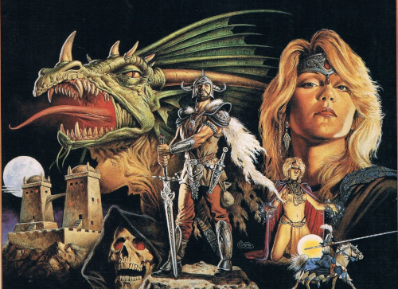

AdndTK CLI - Command line tool for Advanced Dungeons & Dragons (2nd Edition)
=====================================================================

Written by Marco Carosio [https://marcocarosio.it/](https://marcocarosio.it/)

> DISCLAIMER: This software is unofficial content provided under the [Fan Content Policy](https://company.wizards.com/it/fancontentpolicy) of [Wizards of the Coast](https://company.wizards.com/)/[Hasbro](https://products.hasbro.com/it-it) and is not approved or endorsed by the company.

AdndTK CLI is released under [MIT License](LICENSE.md) and in accordance to Fan Content Policy
* it's free of charge;
* it's not an official WOTC product;
* it doesn't make use of copyrighted material;
* it's not sponsored by third parties.

AdndTK CLI is a command line tool designed to exploit the [library](../README.md) features for common tasks like characters generation and browsing the library knowledge base. It may come to handy during a game or to prepare a campaign.

## Getting Started
The CLI tool is built together with the library and tests are performed automatically to ensure the correct tool behaiour. Some common use cases are the following.

### Character generartion
The tool guides the user in a step by step character creation. The task can be achieved in different ways.

Step by step from skills generation:
<pre>
$ adndtk-cli -g [standard|best4|best_twice]
</pre>
Skills can be randomly generated according the three available procedures:
* standard: 3d6 in sequence, scores are assigned in standard order (strength, dexterity, constitution, intelligence, wisdom and charisma);
* best4: 4d6 are rolled, the least result is descarded, then scores are assigned in standard order (strength, dexterity, constitution, intelligence, wisdom and charisma);
* best_twice: 3d6 are rolled twice for each skills, the best score is kept and assigned in standard order (strength, dexterity, constitution, intelligence, wisdom and charisma).
Then the user is proposed a list of available races, according to the skills requisites. Once a race is chosen, a list of suitable classes and moral alignments are displayed.

Step by step from a selected set of skills:
<pre>
$ adndtk-cli -s [skills-list]
</pre>
Skills are taken from the user and must be in the standard order (i.e. Strength, Dexterity, Constitution, Intelligence, Wisdom and Charisma). The values provided must fall in the range 3-18.
This option is designed for those who prefer to roll their own dice and submit those values to the system.
The option guides the user through the options available according to the given set of skills.
If the user choose a class entitled to exceptional strength, then a value is generated and set automatically.
The user is then asked if they want to keep it, reroll it or insert their's own.

Step by step from a selected class:
<pre>
$ adndtk-cli -c [class ID]
</pre>
Class ID can be any of the full name or acronym of the available classes. The table below summarise the available option values:
| Class Full name               | Short name                    | Acronym   |
| :---                          | :---                          | :---      |
| Fighter                       | fighter                       | F         |
| Paladin                       | paladin                       | P         |
| Ranger                        | ranger                        | R         |
| Mage                          | mage                          | M         |
| Fighter Mage                  | figther mage                  | F/M       |
| Abjurer                       | abjurer                       | W_A       |
| Conjurer                      | conjurer                      | W_C       |
| Diviner                       | diviner                       | W_D       |
| Enchanter                     | enchanter                     | W_E       |
| Illusionist                   | illusionist                   | W_I       |
| Fighter Illusionist           | fighter illusionist           | F/I       |
| Invoker                       | invoker                       | W_K       |
| Necromancer                   | necromancer                   | W_N       |
| Transmuter                    | transmuter                    | W_T       |
| Cleric                        | cleric                        | C         |
| Fighter Cleric                | figther cleric                | F/C       |
| Cleric Ranger                 | cleric ranger                 | C/R       |
| Mage Cleric                   | mage cleric                   | M/C       |
| Fighter Mage Cleric           | fighter mage cleric           | F/M/C     |
| Cleric Illusionist	        | fighter illusionist           | C/I       |
| Druid                         | druid                         | D         |
| Fighter Druid                 | fighter druid                 | F/D       |
| Mage Druid                    | mage druid                    | M/D       |
| Fighter Mage Druid            | fighter mage druid            | F/M/D     |
| Preist of Specific Mythos     | preist of specific mythos     | PSM       |
| Thief                         | thief                         | T         |
| Fighter Thief                 | figther thief                 | F/T       |
| Mage Thief                    | mage thief                    | M/T       |
| Fighter Mage Thief            | fighter mage thief            | F/M/T     |
| Illusionist Thief             | illusionist thief             | I/T       |
| Cleric Thief                  | cleric thief                  | C/T       |
| Bard                          | bard                          | B         |

Have fun and long life to AD&D!